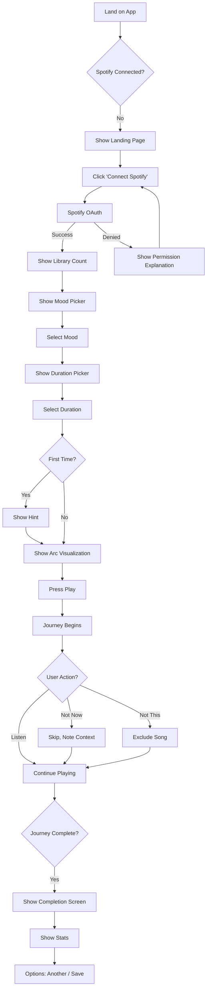
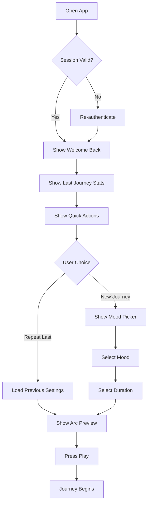
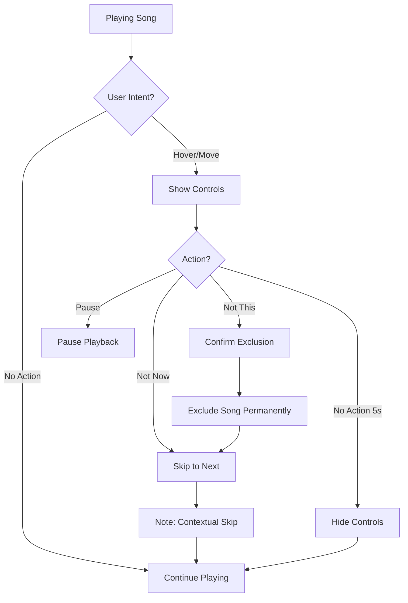

# UX Design Specification - Music-test

**Author:** Vic
**Date:** 2026-01-19

---

## Executive Summary

### Project Vision

Transform Spotify liked songs into intentional DJ-set experiences with designed energy arcs. The core insight: *"We lack magic because we shuffle thousands of songs."*

**Product Differentiator:** Journey Architecture — not "songs that match your mood" but "an experience designed to take you somewhere" with deliberate build → peak → resolve structure.

### Target Users

**Primary Persona: Alex**
- 28, designer, listens to music 6+ hours/day while working
- Has 2,400 liked songs on Spotify but hates shuffle — it ignores mood and context
- Wants to be *taken somewhere*, not make decisions
- Tech-savvy, understands Spotify Premium requirement

**User Archetype:** Music-obsessed professionals who use music as a work tool, not background noise. They have taste, they've curated their library, but the tools fail them.

**Primary Context:** Desktop/laptop, deep work sessions, need to enter flow state

### Key Design Challenges

| Challenge | Why It Matters |
|-----------|----------------|
| **First-song abandonment** | If song 1 doesn't match mood, users quit. Arc visualization must create patience and investment. |
| **Surrender vs Control** | Users want to "not think" but also need escape hatches (skip, "Not This"). Balance is critical. |
| **Communicating the journey** | How do you visualize an energy arc without being clinical? Must feel magical, not like a graph. |
| **Minimal friction return** | Day 2 must be even easier than Day 1. "3 taps to music" target. |
| **Premium requirement** | Must communicate Spotify Premium dependency gracefully before frustration. |

### Design Opportunities

| Opportunity | Impact |
|-------------|--------|
| **Arc Visualization** | Core differentiator. If done well, this IS the product. Users should feel engaged before music starts. |
| **"Welcome back" moment** | Return visit summary ("12 new songs discovered") creates dopamine hit and loyalty. |
| **Journey completion ritual** | The ending matters — "wanting more + feeling complete" paradox. Design a satisfying finale. |
| **Phase awareness** | Showing current position in journey ("you're in the gentle opening") builds trust and patience. |
| **Skip as positive signal** | Reframing skip as "love it, wrong moment" removes guilt and encourages honest feedback. |

---

## Core User Experience

### Defining Experience

**The ONE thing:** Select mood → Surrender to the journey

The product's value is in *not* making decisions. Users open the app, pick a mood, and let the system take them somewhere. The core loop is:

```
Open → Pick mood → Pick duration → Trust the arc → Experience flow state
```

**Critical to get right:** The transition from "I selected a mood" to "I'm engaged with the journey." The arc visualization is the bridge.

### Platform Strategy

| Aspect | Decision | Rationale |
|--------|----------|-----------|
| **Primary Platform** | Web (SPA) | Work listening use case, desktop browser |
| **Input Method** | Mouse/keyboard | Minimal clicks, keyboard shortcuts for playback |
| **Secondary Platform** | Mobile web | Basic support, not optimized |
| **Offline** | Not required | Spotify dependency makes offline moot |
| **Special Capability** | Spotify Web Playback SDK | In-browser playback (Premium required) |

### Effortless Interactions

| What Should Feel Effortless | Current Competitor Pain |
|-----------------------------|------------------------|
| **Return visits** | Other apps forget you, require re-setup |
| **Starting a journey** | Spotify shuffle requires no setup but delivers random chaos |
| **Understanding where you are** | No music app shows you the arc or phase |
| **Giving feedback** | Skip is punishing in Spotify (it learns you hate the song) |
| **Ending a session** | Journeys have no closure, just... stop |

**Target:** 3 taps from app open to music playing (returning user)

### Critical Success Moments

| Moment | What Determines Success |
|--------|------------------------|
| **Arc Preview** | User feels *engaged* before music starts. They understand the journey structure. |
| **First 3 Songs** | User thinks "let's see where this goes" instead of "this doesn't match." Arc context creates patience. |
| **Mid-Journey Peak** | User hits flow state. Loses track of time. The magic happens. |
| **Journey Completion** | User feels "that was amazing" + "I want more." The paradox of a great ending. |
| **Return Visit** | User sees "12 new songs discovered" and feels progress/reward. |

### Experience Principles

1. **Surrender Over Control** — Default is trust. User doesn't need to think. Controls exist but aren't prominent.

2. **Context Creates Patience** — Show where you are in the journey. "You're in the gentle opening" buys time for the magic to build.

3. **Feedback Without Guilt** — Skip is positive ("love it, wrong moment"). "Not This" is the negative signal. No punishment for honest feedback.

4. **Endings Matter** — Design the completion moment. Don't just stop — resolve.

5. **Return > First Visit** — Optimize for Day 2+. The repeat experience should be even better than the first.

---

## Desired Emotional Response

### Primary Emotional Goals

| Emotion | When | Why It Matters |
|---------|------|----------------|
| **Surrender** | Before playback | User lets go of control, trusts the system |
| **Anticipation** | Arc preview | User feels engaged before music starts |
| **Flow** | Mid-journey | User loses track of time, enters deep work state |
| **Magic** | Journey completion | "What just happened? That was incredible." |
| **Satisfaction** | Return visit | "I discovered 12 new songs. This is working." |

**The ultimate feeling:** *Magical transformation* — user ends in a better state than they started.

**North Star Quote:** *"When the set finishes you are left wanting more, staying quiet thinking to yourself OMG what has just happened? This was magical."*

### Emotional Journey Mapping

| Stage | Target Emotion | Anti-Pattern to Avoid |
|-------|----------------|----------------------|
| **First Discovery** | Intrigued, hopeful | Overwhelmed, skeptical |
| **Spotify Connect** | Confident, quick | Anxious about permissions |
| **Mood Selection** | Excited, decisive | Paralyzed by choice |
| **Arc Preview** | Engaged, invested | Impatient, confused |
| **First 3 Songs** | Patient, curious | Disappointed, abandoned |
| **Mid-Journey** | Flow state, timeless | Distracted, skipping constantly |
| **Peak Phase** | Energized, alive | Fatigued, tuned out |
| **Journey End** | Satisfied + wanting more | Abrupt, incomplete |
| **Return Visit** | Welcomed, rewarded | Forgotten, starting over |

### Micro-Emotions

**Critical to cultivate:**

| Micro-Emotion | Design Implication |
|---------------|-------------------|
| **Trust** | Arc visualization builds understanding; skip doesn't punish |
| **Patience** | Phase indicator ("gentle opening") buys time for magic |
| **Accomplishment** | "12 songs discovered" creates progress feeling |
| **Belonging** | "Your journey" — it's personal, crafted for you |

**Critical to avoid:**

| Micro-Emotion | How We Prevent It |
|---------------|-------------------|
| **Guilt** | Skip is positive ("love it, wrong moment") |
| **Frustration** | Clear Premium requirement upfront |
| **Anxiety** | Minimal choices, clear next steps |
| **Abandonment** | Journey has resolution, not just stopping |

### Design Implications

| Emotional Goal | UX Design Approach |
|----------------|-------------------|
| **Surrender** | Hide controls by default, show on hover/intent |
| **Anticipation** | Arc visualization as pre-playback engagement |
| **Flow** | Minimal UI during playback, ambient phase indicator |
| **Magic** | Journey completion animation/moment of reflection |
| **Satisfaction** | Return visit summary with discovery stats |

### Emotional Design Principles

1. **Design for the Ending** — The journey completion moment is as important as the start. Don't just stop — resolve.

2. **Patience Through Context** — When users know where they are in the journey, they wait for the magic instead of abandoning.

3. **Positive Feedback Loops** — Skip = contextual signal, not rejection. "Not This" is the negative. Frame feedback as helping, not criticizing.

4. **Transformation Over Engagement** — Success isn't time-on-app. Success is "I feel great." Measure transformation.

5. **Welcome > Onboard** — Return visits should feel like coming home, not re-onboarding.

---

## UX Pattern Analysis & Inspiration

### Inspiring Products Analysis

#### 1. Live DJ Sets (Core Inspiration)
**What they nail:** Intentional energy management — build, peak, resolve. The DJ reads the room and takes you on a journey. You don't pick songs; you surrender.

**Transferable insight:** The arc IS the product. Structure creates anticipation. Endings matter as much as beginnings.

#### 2. Meditation Apps (Headspace, Calm)
**What they nail:** Simple choices, guided experiences, session structure. You pick a goal and duration, then surrender. Progress tracking ("10 day streak") creates return habit.

**Transferable insight:** Minimal decisions before the experience. Show progress/streaks. Session-based thinking with clear endpoints.

#### 3. Figma (Deep Work Context)
**What they nail:** Gets out of the way during flow. UI recedes when you're working. Multiplayer presence is ambient, not intrusive. Auto-save means no anxiety.

**Transferable insight:** During playback, UI should be minimal/ambient. No fear of losing state. The tool disappears when you're in flow.

#### 4. YouTube Music / SoundCloud
**What they nail:** Discovery through social proof ("trending"), artist radio, endless scroll of related content. YouTube Music's "Your Mix" feels personalized.

**What they miss:** No journey structure. Endless = no completion. Shuffle is still random chaos.

**Transferable insight:** Borrow personalization signals, reject infinite scroll. Our journeys have endings.

#### 5. Spotify Wrapped
**What they nail:** Annual retrospective creates massive engagement. "You discovered 847 new songs" is dopamine. Shareable, social, celebrates the user.

**Transferable insight:** Return visit summary ("12 songs discovered yesterday"). Make the user feel accomplished. Stats as reward.

#### 6. TikTok (Learn, Don't Become)
**What they nail:** Learns preferences insanely fast from behavior. Skip = strong signal. Watch time = engagement.

**What to reject:** Infinite scroll, addiction loops, no endpoint.

**Transferable insight:** Fast behavioral learning from skips. But our journeys END. Finite by design.

### Transferable UX Patterns

| Pattern | Source | Application to Music-test |
|---------|--------|--------------------------|
| **Session-based structure** | Meditation apps | Journey has defined start, arc, and end |
| **Minimal pre-experience choices** | Meditation apps | Mood + duration, that's it |
| **Ambient UI during flow** | Figma | Playback UI recedes, phase indicator is subtle |
| **Progress celebration** | Spotify Wrapped | "12 songs discovered" on return |
| **Behavioral learning** | TikTok | Skip tracking improves future journeys |
| **Intentional endings** | DJ sets | Journey completion moment, not just stopping |
| **Surrender framing** | Tasting menus | "Here's what I've prepared" not "what do you want?" |

### Anti-Patterns to Avoid

| Anti-Pattern | Why It Fails | Our Alternative |
|--------------|--------------|-----------------|
| **Infinite scroll** | No completion, no satisfaction | Journeys have defined endpoints |
| **Shuffle chaos** | Context-blind, random | Arc-structured, mood-matched |
| **Skip = punishment** | Creates guilt, dishonest feedback | Skip = "love it, wrong moment" |
| **Complex onboarding** | Friction before value | One-click Spotify connect |
| **Cluttered playback UI** | Breaks flow state | Minimal, ambient during journey |
| **No progress tracking** | No reason to return | Discovery stats, journey history |
| **Abrupt endings** | Feels incomplete | Designed completion moment |

### Design Inspiration Strategy

**Adopt Directly:**
- Meditation app session structure (pick goal, pick duration, surrender)
- Spotify Wrapped progress celebration (stats on return)
- Figma's ambient UI philosophy (disappear during flow)

**Adapt for Our Context:**
- TikTok's fast learning → but finite, not infinite
- DJ set arc structure → visualized, not hidden
- Tasting menu framing → "Your focused journey" not "choose songs"

**Deliberately Reject:**
- YouTube Music / SoundCloud infinite scroll
- Spotify's punishing skip behavior
- Any pattern that breaks the "surrender" experience

---

## Design System Foundation

### Design System Choice

**Selected:** Tailwind CSS + shadcn/ui

A utility-first CSS framework with headless, copy-paste components that provide speed without sacrificing customization.

### Rationale for Selection

| Factor | Why Tailwind + shadcn/ui |
|--------|--------------------------|
| **Speed** | Pre-built accessible components, copy-paste into codebase |
| **Customization** | Full control over look and feel — arc visualization needs custom design |
| **Simplicity** | Aligns with meditation app inspiration — clean, minimal |
| **No lock-in** | Components live in your codebase, not a dependency |
| **Dark mode** | Built-in support (music apps often use dark themes) |
| **Small bundle** | Only include what you use |
| **Framework fit** | Works perfectly with SvelteKit or Next.js |

### Implementation Approach

1. **Install Tailwind CSS** — utility-first foundation
2. **Add shadcn/ui components** — buttons, cards, dialogs, sliders
3. **Define custom design tokens** — colors, spacing, typography for Music-test brand
4. **Build custom components** — Arc visualization, phase indicator, journey player (unique to us)

### Customization Strategy

| Element | Approach |
|---------|----------|
| **Colors** | Dark theme base (like Spotify), accent colors for mood categories |
| **Typography** | Clean sans-serif, large for surrender/minimal UI |
| **Spacing** | Generous whitespace — meditation app influence |
| **Motion** | Subtle, purposeful — arc visualization smooth transitions |
| **Custom Components** | Arc visualization, mood picker, phase indicator — built from scratch |

---

## Defining Core Experience

### The Defining Interaction

**The ONE interaction:** "See the journey arc, trust the structure, surrender to the music."

The arc visualization transforms a playlist into a journey. It must work **at a glance** — users should understand the structure in under 1 second, like seeing album art.

### User Mental Model

**Current mental model (what users expect):**
- "I pick songs, I hit play, I skip when I don't like something"
- Skip = rejection, algorithm punishes me

**New mental model we're creating:**
- "I pick a mood, I see the journey, I trust the arc"
- **"Not now"** = contextual feedback (renamed from "Skip" to reinforce mental model shift)
- "Not This" = permanent exclusion

**First-time hint (novel pattern support):**
> *"Your journey builds from gentle to peak, then resolves."*
> — Shown once on first arc preview, dismissable, never shown again.

### Success Criteria

**Single validation metric:** First-journey completion rate

If users complete their first journey without abandoning in the first 3 songs, the arc visualization is working.

| Criteria | Indicator |
|----------|-----------|
| **Primary** | First-journey completion rate > 60% |
| **Secondary** | First-3-song skip rate < 30% |
| **Tertiary** | Return within 48 hours > 50% |

### Arc Visualization: Visual Metaphor

**MVP Design:** Simple horizontal timeline with phase labels

```
[Opening] ——— [Build] ——— [Peak] ——— [Resolve]
    ●
 You are here
```

**Characteristics:**
- Works at a glance (< 1 second comprehension)
- Phase labels are descriptive (not just icons)
- Current position shown with subtle indicator
- No animation required for MVP (can add later)

**Future iteration:** Wave/curve showing energy over time, animated current position.

### Experience Mechanics

#### 1. Initiation: Mood Selection

| Step | User Action | System Response |
|------|-------------|-----------------|
| 1 | Opens app | Sees 6 mood options |
| 2 | Taps mood | Duration picker appears |
| 3 | Selects duration | Arc visualization generates |

#### 2. Interaction: Arc Preview

| Step | User Action | System Response |
|------|-------------|-----------------|
| 4 | Sees arc | Timeline shows phases (Opening → Build → Peak → Resolve) |
| 5 | First time only | Hint: "Your journey builds from gentle to peak, then resolves." |
| 6 | Glances at structure | Understands in < 1 second |
| 7 | Hits play | Journey begins |

#### 3. Feedback: During Journey

| Step | User Action | System Response |
|------|-------------|-----------------|
| 8 | Listens | Phase indicator shows current position |
| 9 | "Not now" (optional) | System notes contextual feedback, no punishment |
| 10 | "Not This" (optional) | Song permanently excluded |
| 11 | Flow state | UI recedes, ambient phase indicator only |

#### 4. Completion: Journey End

| Step | User Action | System Response |
|------|-------------|-----------------|
| 12 | Final song plays | Arc shows "Resolve" phase highlighted |
| 13 | Music fades | Screen transitions to summary |
| 14 | Summary appears | Large text: "Journey Complete" |
| 15 | Stats display | "1h 47m • 12 songs discovered • 3 new favorites" |
| 16 | Subtle celebration | Gentle pulse animation (calm, not gamified) |
| 17 | Options appear | "Start another journey" / "Save playlist" |

**Completion feel:** Calm satisfaction, not gamified excitement. Like finishing a great meditation session.

---

## Visual Design Foundation

### Color System

**Theme:** Dark mode primary (music apps convention, reduces eye strain during long work sessions)

| Token | Purpose | Value |
|-------|---------|-------|
| **Background** | Main canvas | Near-black (`#0a0a0a` or `#121212`) |
| **Surface** | Cards, containers | Dark gray (`#1a1a1a`) |
| **Text Primary** | Main content | Off-white (`#fafafa`) |
| **Text Secondary** | Labels, hints | Medium gray (`#a1a1a1`) |

**Mood Accent Colors:**

| Mood | Accent Color | Hex | Rationale |
|------|--------------|-----|-----------|
| **Energetic** | Orange/Amber | `#f59e0b` | Energy, warmth, movement |
| **Chill** | Teal/Cyan | `#06b6d4` | Calm, cool, relaxed |
| **Melancholic** | Purple/Violet | `#8b5cf6` | Depth, emotion, introspection |
| **Focused** | Blue | `#3b82f6` | Clarity, productivity, trust |
| **Uplifting** | Yellow/Gold | `#eab308` | Joy, optimism, brightness |
| **Dark** | Deep Red | `#dc2626` | Intensity, passion, depth |

**Arc Phase Colors:**
- Opening: Soft blue-gray (subtle)
- Build: Warming toward accent
- Peak: Full accent color
- Resolve: Cooling back to neutral

### Typography System

**Philosophy:** Clean, modern, legible at a glance. No decorative fonts.

| Element | Font | Size | Weight |
|---------|------|------|--------|
| **Display** | Inter / System sans | 48px | Bold |
| **H1** | Inter | 32px | Semibold |
| **H2** | Inter | 24px | Medium |
| **Body** | Inter | 16px | Regular |
| **Caption** | Inter | 14px | Regular |

**Font choice rationale:** Inter is free, excellent at all sizes, optimized for screens, works with Tailwind defaults.

### Spacing & Layout Foundation

**Base unit:** 4px (Tailwind default)

**Philosophy:** Generous whitespace — meditation app influence. Let elements breathe.

| Token | Value | Use Case |
|-------|-------|----------|
| **xs** | 4px | Tight element grouping |
| **sm** | 8px | Related content |
| **md** | 16px | Standard content spacing |
| **lg** | 24px | Section separation |
| **xl** | 32px | Major section breaks |
| **2xl** | 48px | Screen-level padding |

**Layout principles:**
1. Center-stage content — mood picker and arc visualization get visual focus
2. Edge-to-edge on mobile — content fills screen
3. Max-width on desktop — readable line lengths, centered layout
4. Arc visualization may benefit from full-width treatment

### Accessibility Considerations

| Requirement | Approach |
|-------------|----------|
| **Contrast** | WCAG AA minimum (4.5:1 for text) |
| **Focus states** | Visible outline on all interactive elements |
| **Color independence** | Phase labels are text, not color-only |
| **Motion** | Respect `prefers-reduced-motion` for animations |

---

## Design Direction Decision

### Design Directions Explored

Four design directions were evaluated:

1. **Meditation App Minimal** — Maximum whitespace, centered content, calm feel
2. **Spotify Familiar** — Dense, sidebar navigation, familiar patterns
3. **Arc-Centered Hero** — Arc visualization as hero, mood row, big play button
4. **Full-Screen Immersive** — Cinematic, swipeable moods, dramatic

### Chosen Direction

**Direction 3: Arc-Centered Hero**

The arc visualization takes center stage as the defining visual element. Mood selection is quick and horizontal, the play button is prominent, and the entire layout supports the "see arc, trust structure, surrender" experience.

### Design Rationale

| Why This Works | How It Supports Goals |
|----------------|----------------------|
| **Arc is the hero** | Supports defining experience — users see journey structure before playing |
| **Horizontal mood row** | Quick scanning, low friction (meditation app pattern) |
| **Big play button** | Obvious action, supports surrender |
| **Minimal chrome** | UI gets out of the way, Figma-inspired ambient feel |
| **MVP buildable** | Simple layout, achievable in 2-4 weeks |
| **Differentiated** | No other music app looks like this |

### Key Layout Elements

**Pre-playback screen:**
- User avatar/logout in top-right (subtle)
- Mood options as horizontal row (icon + label)
- Selected mood highlighted with accent color
- Arc visualization below moods (timeline with phase labels)
- Duration picker integrated
- Large centered play button
- Song count as context

**During playback:**
- Arc becomes progress indicator (current position highlighted)
- Current song + artist
- Phase label visible ("You're in: Build")
- "Not now" and "Not This" buttons (subtle, appear on hover/intent)
- UI recedes after 5 seconds of no interaction

**Journey complete:**
- Full-screen summary
- "Journey Complete" large text
- Stats: duration, songs discovered
- Gentle pulse animation
- "Start another" / "Save playlist" options

### Implementation Approach

1. **Single-page layout** — no navigation needed for MVP
2. **State-driven UI** — pre-play, playing, complete states
3. **Tailwind + shadcn/ui** — buttons, cards, sliders from design system
4. **Custom components** — Arc visualization, mood picker, phase indicator
5. **Dark theme default** — matches visual foundation

---

## User Journey Flows

### Journey 1: First-Time User Flow

**Goal:** New user connects Spotify and experiences their first journey.



**Key Moments:**

| Moment | Design Requirement |
|--------|-------------------|
| **Spotify OAuth** | Single-click, clear permission explanation if denied |
| **Library confirmation** | "2,400 songs found" — immediate value signal |
| **First-time hint** | One sentence, dismissable, never shown again |
| **Arc preview** | < 1 second comprehension, phase labels visible |
| **During playback** | UI recedes, phase indicator ambient |
| **Completion** | Full summary, calm celebration |

### Journey 2: Returning User Flow

**Goal:** Logged-in user starts a new journey with minimal friction.



**Optimization: 3 Taps to Music**

| Tap | Action | Result |
|-----|--------|--------|
| 1 | Open app | See welcome + quick repeat option |
| 2 | Tap "Repeat Last" or mood | Load settings / select mood |
| 3 | Tap Play | Journey begins |

### Journey 3: Mid-Journey Interactions

**Goal:** User provides feedback during playback without breaking flow.



**Interaction Details:**

| Action | Trigger | Feedback |
|--------|---------|----------|
| **Show controls** | Mouse move / tap | Fade in from bottom |
| **Hide controls** | 5s no interaction | Fade out |
| **"Not Now"** | Click button | Skip immediately, subtle "noted" |
| **"Not This"** | Click button | Brief confirmation, then skip |
| **Pause** | Click or spacebar | Large pause icon, arc preserved |

### Journey Patterns

**Navigation Patterns:**
- Single-page flow — no back button needed, state-driven transitions
- Quick repeat — returning users bypass mood selection

**Decision Patterns:**
- Minimal choices — 6 moods, 4 durations
- Obvious default — last used settings are prominent

**Feedback Patterns:**
- Ambient progress — arc indicator shows position subtly
- Contextual controls — appear on intent, disappear when not needed
- Positive framing — "Not Now" instead of "Skip"

### Flow Optimization Principles

1. **Progressive disclosure** — show only what's needed at each step
2. **Default to success** — if user does nothing, good things happen
3. **Recoverable states** — can always pause, resume, or start over
4. **Minimal interruption** — feedback signals are subtle, not modal
5. **Memory across sessions** — app remembers preferences

---

## Component Strategy

### Design System Components (shadcn/ui)

These components from shadcn/ui provide the foundation, customized with our dark theme and mood accent colors:

| Component | Use Case | Customization |
|-----------|----------|---------------|
| **Button** | Play, "Not Now", "Not This", "Start Another" | Primary (accent), Ghost (subtle actions) |
| **Card** | Journey summary, mood option containers | Dark surface, subtle border |
| **Slider** | Duration picker (30min to 4hr range) | Accent color track |
| **Progress** | Loading states, library sync | Accent color fill |
| **Toast** | "Noted" feedback, errors | Subtle, bottom-positioned |
| **Tooltip** | First-time hints, button explanations | Dark background, clear text |

### Custom Components

These components are unique to Music-test and must be built from scratch:

#### 1. Arc Visualization (Hero Component)

**Purpose:** The defining visual — shows journey phases and current position.

**Anatomy:**
- Horizontal timeline spanning container width
- 4 phase segments: Opening, Build, Peak, Resolve
- Phase labels below each segment
- Current position indicator (dot or highlight)
- Progress fill showing completed portion

**States:**
| State | Appearance |
|-------|------------|
| **Preview** | All phases visible, no position indicator |
| **Playing** | Current phase highlighted, position dot animated |
| **Complete** | Full fill, "Resolve" emphasized |

**Accessibility:**
- `role="progressbar"` with `aria-valuenow`
- Phase labels are text, not color-only
- Screen reader: "Currently in Build phase, 45% complete"

**Variants:**
- Compact (during playback, less prominent)
- Expanded (arc preview, full detail)

#### 2. Mood Picker

**Purpose:** Quick mood selection with visual appeal.

**Anatomy:**
- Horizontal row of 6 mood options
- Each option: icon + label + accent color
- Selected state: filled background with accent

**Moods:**
| Mood | Icon | Accent |
|------|------|--------|
| Energetic | ⚡ | `#f59e0b` (amber) |
| Chill | 🌊 | `#06b6d4` (cyan) |
| Melancholic | 🌙 | `#8b5cf6` (purple) |
| Focused | 🎯 | `#3b82f6` (blue) |
| Uplifting | ☀️ | `#eab308` (yellow) |
| Dark | 🔥 | `#dc2626` (red) |

**States:**
| State | Appearance |
|-------|------------|
| **Default** | Ghost style, icon + label |
| **Hover** | Subtle background fill |
| **Selected** | Full accent background, white text |
| **Disabled** | Reduced opacity (if no songs match) |

**Accessibility:**
- `role="radiogroup"` with `aria-label="Select mood"`
- Each option is `role="radio"` with `aria-checked`
- Keyboard: arrow keys to navigate, Enter to select

#### 3. Phase Indicator

**Purpose:** Ambient display of current journey phase during playback.

**Anatomy:**
- Small, unobtrusive label
- Current phase name
- Subtle accent color glow

**Format:** "You're in: [Phase]"

**States:**
| State | Appearance |
|-------|------------|
| **Visible** | Soft glow, readable text |
| **Receded** | Reduced opacity (during flow state) |
| **Transitioning** | Brief animation when phase changes |

**Behavior:**
- Fades to ~40% opacity after 5s of no interaction
- Returns to full opacity on hover/movement
- Phase transition: gentle crossfade animation

**Accessibility:**
- `aria-live="polite"` for phase changes
- Screen reader announces phase transitions

#### 4. Journey Summary

**Purpose:** Completion screen with session stats and next actions.

**Anatomy:**
- Large "Journey Complete" heading
- Stats row: duration, songs discovered, favorites
- Subtle celebration animation
- Action buttons: "Start Another", "Save Playlist"

**Stats Display:**
```
1h 47m • 12 songs discovered • 3 new favorites
```

**Animation:** Gentle pulse on stats (subtle, not gamified)

**States:**
| State | Appearance |
|-------|------------|
| **Appearing** | Fade in from center |
| **Resting** | Stats visible, actions ready |
| **Dismissed** | Fade out to mood picker |

**Accessibility:**
- Focus automatically moves to summary on completion
- Screen reader: "Journey complete. 1 hour 47 minutes. 12 songs discovered."
- Action buttons clearly labeled

#### 5. Playback Controls

**Purpose:** Minimal controls that appear on intent, disappear during flow.

**Anatomy:**
- "Not Now" button (primary action)
- "Not This" button (secondary, destructive)
- Pause/Play toggle
- Current song + artist display

**Layout:**
```
[Song Title - Artist]
[Not Now] [Pause] [Not This]
```

**States:**
| State | Appearance |
|-------|------------|
| **Hidden** | Not visible (flow state) |
| **Visible** | Fade in from bottom |
| **Hover** | Button states highlight |

**Behavior:**
- Appears on: mouse movement, tap, keyboard input
- Disappears after: 5 seconds of no interaction
- Keyboard shortcuts: Space (pause), Right Arrow (Not Now), Backspace (Not This)

**Accessibility:**
- All controls keyboard-accessible
- `aria-label` on icon-only buttons
- Focus trap when visible

### Component Interaction Model

**Visibility States:**

```
Pre-playback: Mood Picker → Duration → Arc Visualization (full)
Playing:      Arc (compact) + Phase Indicator + Controls (on intent)
Complete:     Journey Summary (full screen)
```

**State Transitions:**

| From | To | Trigger | Animation |
|------|----|---------|-----------|
| Mood Picker | Arc Preview | Duration selected | Slide up |
| Arc Preview | Playing | Play pressed | Crossfade |
| Playing | Playing | Phase change | Subtle glow shift |
| Playing | Summary | Journey ends | Fade to center |
| Summary | Mood Picker | "Start Another" | Crossfade |

### Implementation Priority

| Priority | Component | Rationale |
|----------|-----------|-----------|
| **P0** | Arc Visualization | Core differentiator, must be excellent |
| **P0** | Mood Picker | Entry point to every journey |
| **P0** | Playback Controls | Essential for feedback system |
| **P1** | Phase Indicator | Enhances "context creates patience" |
| **P1** | Journey Summary | Completion ritual matters |

---

## UX Consistency Patterns

### Button Hierarchy

**Philosophy:** Three tiers with clear visual distinction. Users should never wonder "what does this button do?"

| Tier | Style | Use Case | Examples |
|------|-------|----------|----------|
| **Primary** | Solid, accent color fill, large | Main action, what we want users to do | "Play Journey", "Start Another" |
| **Secondary** | Outlined, accent border | Important but not primary | "Save Playlist", "Not Now" |
| **Destructive** | Ghost, red accent on hover | Permanent actions with consequences | "Not This" (excludes song forever) |
| **Ghost** | Text only, subtle hover | Tertiary actions, escape hatches | "Logout", "Cancel" |

**Button Sizing:**

| Context | Size | Touch Target |
|---------|------|--------------|
| Hero action (Play) | Large (56px height) | 56×56px minimum |
| Standard actions | Medium (44px height) | 44×44px minimum |
| Inline/subtle | Small (32px height) | 44×44px touch area |

**Button States:**

| State | Visual Treatment |
|-------|------------------|
| **Default** | Base styling |
| **Hover** | Slight brightness increase (+10%) |
| **Active** | Slight scale down (0.98) |
| **Disabled** | 50% opacity, cursor not-allowed |
| **Loading** | Spinner replaces text, disabled state |

**Accessibility:**
- All buttons 44px minimum touch target
- Visible focus ring (2px accent color outline, 2px offset)
- `aria-label` for icon-only buttons
- `aria-disabled` rather than removing from DOM

### Feedback Patterns

**Philosophy:** Feedback should be subtle, positive, and never interrupt flow.

#### Success Feedback

| Situation | Feedback Type | Visual | Duration |
|-----------|---------------|--------|----------|
| "Not Now" pressed | Toast | "Noted" bottom-right | 1.5s auto-dismiss |
| Journey complete | Full screen | Summary with stats | Persistent until action |
| Spotify connected | Inline | "2,400 songs found" | Persistent, then transitions |
| Playlist saved | Toast | "Saved to Spotify" | 2s auto-dismiss |

#### Contextual Feedback

| Situation | Feedback Type | Visual |
|-----------|---------------|--------|
| Phase transition | Phase indicator update | Subtle glow shift, text change |
| Song change | Now playing update | Crossfade to new song info |
| "Not This" confirmed | Toast | "Song excluded" (neutral tone) |

#### Error Feedback

| Situation | Feedback Type | Visual | Recovery Action |
|-----------|---------------|--------|-----------------|
| Spotify disconnected | Banner | Top of screen, red accent | "Reconnect" button |
| Playback failed | Toast | "Couldn't play. Trying next..." | Auto-retry |
| Premium required | Modal | Center screen, explanation | "Learn more" link |
| Network lost | Banner | Persistent top banner | Auto-dismiss on reconnect |

**Error Design Principles:**
1. **Explain, don't blame** — "Spotify Premium required" not "You don't have Premium"
2. **Offer recovery** — Every error has a clear next step
3. **Auto-recover when possible** — Playback errors skip to next song automatically
4. **Non-blocking when possible** — Toasts over modals

### Loading States

**Philosophy:** Loading should feel intentional, not broken. Use the journey metaphor.

| Situation | Loading Treatment | Copy |
|-----------|------------------|------|
| Spotify OAuth | Full screen spinner | "Connecting to Spotify..." |
| Library sync | Progress bar + count | "Found 1,247 songs..." (live count) |
| Journey generation | Arc animation | "Crafting your journey..." |
| Song loading | Skeleton + spinner | Current song area pulses |

**Skeleton Patterns:**
- Arc visualization: Pulsing gray segments
- Song info: Two-line skeleton (title + artist widths)
- No skeletons for buttons (they're always ready)

**Loading Principles:**
1. **Progress over spinner** — Show determinate progress when possible
2. **Meaningful copy** — "Crafting your journey" not "Loading..."
3. **Maintain layout** — Skeletons match final content dimensions
4. **Quick transitions** — Don't show loading for <300ms operations

### Empty States

**Philosophy:** Empty states should guide users forward, never dead-end.

| Situation | Message | Visual | Action |
|-----------|---------|--------|--------|
| No songs match mood | "No songs found for this mood yet. Try another mood, or like more songs on Spotify." | Mood icon, muted | "Try Another Mood" button |
| Library empty | "Connect Spotify to start your journey." | Spotify icon | "Connect Spotify" button |
| Journey history empty | "Your first journey awaits." | Arc outline, subtle | Links to mood picker |

**Empty State Principles:**
1. **Explain why** — What happened
2. **Guide forward** — Clear next action
3. **Stay on-brand** — Use journey language
4. **Never blame** — "Not yet" not "You haven't"

### State Transitions

**Philosophy:** Transitions should feel smooth and intentional, reinforcing the journey metaphor.

| Transition | Animation | Duration | Easing |
|------------|-----------|----------|--------|
| Screen to screen | Crossfade | 300ms | ease-out |
| Controls appear | Slide up + fade | 200ms | ease-out |
| Controls disappear | Fade out | 300ms | ease-in |
| Phase change | Color shift + text fade | 400ms | ease-in-out |
| Toast appear | Slide up + fade | 200ms | ease-out |
| Toast disappear | Fade out | 150ms | ease-in |
| Modal open | Fade + scale (0.95→1) | 200ms | ease-out |
| Modal close | Fade + scale (1→0.95) | 150ms | ease-in |

**Motion Principles:**
1. **Respect preferences** — Honor `prefers-reduced-motion`
2. **Quick but smooth** — Under 400ms for most transitions
3. **Ease-out for enters** — Quick start, gentle finish
4. **Ease-in for exits** — Gentle start, quick finish
5. **No bounces** — Calm, not playful

### Accessibility Patterns

**WCAG 2.1 AA Compliance:**

| Requirement | Implementation |
|-------------|----------------|
| **Color contrast** | 4.5:1 for text, 3:1 for large text/icons |
| **Focus visible** | 2px accent outline, 2px offset on all interactive |
| **Keyboard nav** | Full keyboard support, logical tab order |
| **Screen reader** | All interactive elements labeled, live regions for updates |
| **Motion** | `prefers-reduced-motion` disables animations |

**Keyboard Shortcuts (During Playback):**

| Key | Action |
|-----|--------|
| Space | Pause / Resume |
| → (Right Arrow) | "Not Now" (skip) |
| Backspace | "Not This" (exclude) |
| Escape | Show/hide controls |

**Screen Reader Announcements:**

| Event | Announcement |
|-------|--------------|
| Journey starts | "Journey started. Now playing: [Song] by [Artist]" |
| Phase change | "Now entering [Phase] phase" |
| Song change | "Now playing: [Song] by [Artist]" |
| Journey complete | "Journey complete. [Stats]" |

---

## Responsive Design & Accessibility

### Responsive Strategy

**Design Philosophy:** Desktop-first with graceful mobile degradation

Music-test is optimized for work listening on desktop — users in flow state, keyboard nearby, large screen for the arc visualization. Mobile is a "functional fallback" for checking journey history or quick starts, not the primary experience.

| Device | Priority | Experience Level |
|--------|----------|------------------|
| **Desktop (1024px+)** | Primary | Full experience, all features |
| **Tablet (768px-1023px)** | Secondary | Desktop-like, touch-friendly |
| **Mobile (320px-767px)** | Tertiary | Simplified, essential features |

#### Desktop Strategy (1024px+)

- **Arc visualization:** Full-width, prominent hero placement
- **Mood picker:** Horizontal row with labels
- **Controls:** Appear on hover, keyboard shortcuts available
- **Layout:** Centered content with max-width (1200px)
- **Information density:** Full stats, phase labels, song metadata

#### Tablet Strategy (768px-1023px)

- **Arc visualization:** Full-width, slightly reduced padding
- **Mood picker:** Horizontal row, touch targets 48px minimum
- **Controls:** Always visible (no hover state on touch)
- **Layout:** Edge-to-edge with 24px padding
- **Touch optimization:** Larger tap targets, swipe gestures for skip

#### Mobile Strategy (320px-767px)

- **Arc visualization:** Simplified, stacked vertically or condensed
- **Mood picker:** 2×3 grid instead of horizontal row
- **Controls:** Fixed at bottom, always visible during playback
- **Layout:** Full-width, minimal chrome
- **Prioritization:** Focus on play/pause, skip — hide secondary actions

### Breakpoint Strategy

**Approach:** Desktop-first with min-width media queries

| Breakpoint | Tailwind Class | Target |
|------------|---------------|--------|
| **Default** | (none) | Desktop (1024px+) |
| **lg:hidden** | `@media (max-width: 1023px)` | Hide on tablet/mobile |
| **md:** | `@media (min-width: 768px)` | Tablet enhancements |
| **sm:** | `@media (min-width: 640px)` | Large mobile |
| **xs:** | `@media (max-width: 639px)` | Small mobile adjustments |

**Layout Behavior:**

| Element | Desktop | Tablet | Mobile |
|---------|---------|--------|--------|
| **Arc** | Horizontal, full detail | Horizontal, compact | Simplified/vertical |
| **Mood Picker** | Row (6 items) | Row (6 items, touch) | Grid (2×3) |
| **Duration** | Slider + labels | Slider + labels | Preset buttons |
| **Controls** | Hover reveal | Always visible | Fixed bottom bar |
| **Song info** | Full metadata | Full metadata | Title + artist only |

### Accessibility Strategy

**Compliance Level:** WCAG 2.1 AA

This level ensures good accessibility for all users while remaining achievable for MVP.

#### Color & Contrast

| Requirement | Standard | Our Implementation |
|-------------|----------|-------------------|
| Text contrast | 4.5:1 minimum | Off-white (#fafafa) on near-black (#0a0a0a) = 18:1 |
| Large text/icons | 3:1 minimum | All accent colors tested against dark background |
| Non-text contrast | 3:1 for UI | Focus rings, borders clearly visible |

**Color Independence:**
- Phase labels are text, not color-only
- Mood names accompany mood colors
- Error states have icons + text, not just red

#### Keyboard Navigation

**Full keyboard support required:**

| Context | Key | Action |
|---------|-----|--------|
| **Mood picker** | Arrow keys | Navigate moods |
| **Mood picker** | Enter/Space | Select mood |
| **Duration** | Arrow keys | Adjust duration |
| **Playback** | Space | Pause/resume |
| **Playback** | Right arrow | "Not Now" (skip) |
| **Playback** | Backspace | "Not This" (exclude) |
| **Global** | Tab | Move focus forward |
| **Global** | Shift+Tab | Move focus backward |
| **Global** | Escape | Close overlays/modals |

**Focus Management:**
- Visible focus ring on all interactive elements (2px accent outline)
- Logical tab order following visual flow
- Focus trapped in modals until dismissed
- Focus returned to trigger element after modal close

#### Screen Reader Support

**Semantic Structure:**
- `<main>` for primary content
- `<header>` for top bar (if present)
- `<nav>` for mood selection (radiogroup)
- Proper heading hierarchy (h1 → h2 → h3)

**ARIA Implementation:**

| Element | ARIA Pattern |
|---------|--------------|
| Mood picker | `role="radiogroup"` with `aria-label` |
| Each mood | `role="radio"` with `aria-checked` |
| Arc visualization | `role="progressbar"` with `aria-valuenow`, `aria-valuetext` |
| Phase indicator | `aria-live="polite"` for updates |
| Toast notifications | `role="status"` with `aria-live="polite"` |
| Error banners | `role="alert"` |

**Live Regions:**
- Phase changes announced via `aria-live="polite"`
- Song changes announced
- Error states announced immediately (`aria-live="assertive"`)

#### Motion & Reduced Motion

**Respect `prefers-reduced-motion`:**

```css
@media (prefers-reduced-motion: reduce) {
  * {
    animation-duration: 0.01ms !important;
    transition-duration: 0.01ms !important;
  }
}
```

**Alternative behaviors:**
- Phase transitions: Instant swap instead of crossfade
- Control visibility: Instant show/hide instead of fade
- Completion animation: No pulse, static display

### Testing Strategy

#### Responsive Testing

**Device Matrix:**

| Category | Devices | Priority |
|----------|---------|----------|
| **Desktop** | Chrome, Firefox, Safari, Edge (Windows/Mac) | P0 |
| **Tablet** | iPad (Safari), Android tablet (Chrome) | P1 |
| **Mobile** | iPhone Safari, Android Chrome | P2 |

**Testing Approach:**
1. Browser DevTools responsive mode for rapid iteration
2. Real device testing before release
3. BrowserStack for cross-browser validation

#### Accessibility Testing

**Automated Testing:**
- axe-core in development (catches ~30% of issues)
- Lighthouse accessibility audit (CI integration)
- ESLint jsx-a11y plugin for React/JSX

**Manual Testing:**

| Test | Tool/Method | Frequency |
|------|-------------|-----------|
| Keyboard navigation | Unplug mouse, navigate app | Every feature |
| Screen reader | VoiceOver (Mac), NVDA (Windows) | Before release |
| Color contrast | WebAIM contrast checker | Design review |
| Color blindness | Sim Daltonism, browser extensions | Design review |
| Touch targets | Manual measurement | Every component |

**User Testing:**
- MVP: Test with 2-3 users who use keyboard-only navigation
- Post-MVP: Include users with visual impairments in beta testing

### Implementation Guidelines

#### Responsive Development

**CSS Strategy:**

```css
/* Desktop-first approach */
.mood-picker {
  display: flex;
  flex-direction: row;
}

@media (max-width: 767px) {
  .mood-picker {
    display: grid;
    grid-template-columns: repeat(3, 1fr);
  }
}
```

**Component Guidelines:**
- Use Tailwind responsive prefixes (`md:`, `lg:`) consistently
- Test touch targets on every interactive element (44px minimum)
- Use `rem` for typography, `px` for borders/shadows
- Images: Use `srcset` for different resolutions

#### Accessibility Development

**HTML Semantics:**
- Use native HTML elements first (`<button>`, not `<div onclick>`)
- Proper heading hierarchy (never skip levels)
- Meaningful link text (not "click here")
- Alt text for any informational images

**Focus States:**

```css
:focus-visible {
  outline: 2px solid var(--accent-color);
  outline-offset: 2px;
}
```

**Skip Links:**
- Include "Skip to main content" link (hidden until focused)
- Visible on focus for keyboard users

**Testing Checklist:**
- [ ] All interactive elements keyboard accessible
- [ ] Focus visible on all elements
- [ ] Screen reader announces all content meaningfully
- [ ] No keyboard traps
- [ ] Color not the only way to convey information
- [ ] Text resizes without breaking layout (up to 200%)
